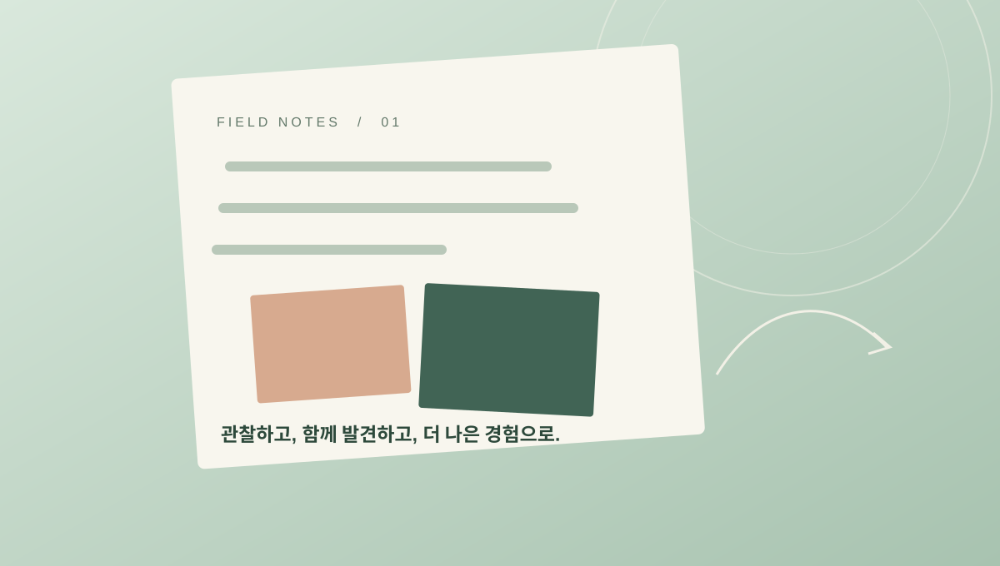

새로운 제품을 구상할 때 우리는 종종 빠르게 답부터 찾으려 합니다. 하지만 무엇을 만들지 정하기 전에, 누구의 어떤 순간을 바꾸고 싶은지 묻는 일이 먼저입니다.

## 사용자의 맥락을 살피기

사람들은 기능 목록보다 하루의 흐름 속에서 제품을 만납니다. 필요한 순간에 자연스럽게 도움을 주는지, 예상하지 못한 불편을 만들지는 않는지 살펴보면 개선의 우선순위가 선명해집니다.

> 좋은 질문은 더 많은 기능이 아니라 더 나은 선택으로 이어집니다.

## 작은 변화부터 함께 만들기

관찰에서 발견한 문제를 팀과 함께 정리하고, 지금 시작할 수 있는 변화로 구체화합니다. 실제 사용자의 반응을 살펴 다시 배우는 과정을 반복하면 처음의 아이디어는 오래 쓰이는 경험으로 자라납니다.

우리는 그 첫 질문을 함께 찾는 일을 소중하게 생각합니다.
